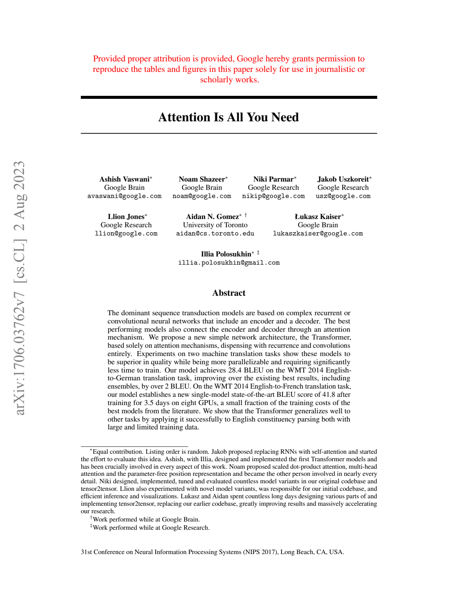

# OCR Preview and Parsed Content Report

- Generated on: 2026-04-20
- Goal: visual preview of files plus extracted parsed content (OCR-aware).
- Detailed table-focused OCR proof (PDF + DOCX, OCR ON/OFF): [ocr_table_examples_report.md](ocr_table_examples_report.md)

## 1. Synthetic image OCR sample

- Source file: test_results/ocr/assets/ocr_demo_invoice.png
- Parser strategy: ocr_image:png|engines:rapidocr,tesseract|libs:pillow=12.2.0,rapidocr-onnxruntime=1.4.4,pytesseract=0.3.13|rapidocr|lines:5|avg_conf:0.99
- Parser error: None
- OCR attempted: True
- OCR used: True
- OCR pages: 1
- OCR supplement pages: 1
- OCR engine trace: rapidocr|lines:5|avg_conf:0.99


### Parsed content preview

```text
INVOICE 2026-04-20
Client ACME AERO
Amount 1532 EUR
Due date: 2026-05-20
Reference: OCR-DEMO-01
```

## 2. Scanned-like PDF OCR sample

- Source file: test_results/ocr/assets/ocr_demo_scanned_invoice.pdf
- Parser strategy: pdfplumber:pdf|table_text_excluded:1|libs:pdfplumber=0.11.5|ocr_pages:1|ocr_supplement_pages:1|ocr_trace:p1:rapidocr|lines:5|avg_conf:0.97
- Parser error: None
- OCR attempted: True
- OCR used: True
- OCR pages: 1
- OCR supplement pages: 1
- OCR engine trace: p1:rapidocr|lines:5|avg_conf:0.97


### Parsed content preview

```text
## Page 1

INVOICE2026-04-20
Client ACME AERO
Amount1532EUR
Due date:2026-05-20
Reference:OCR-DEMO-01
```

## 3. Born-digital PDF with selective OCR supplement

- Source file: benchmark_samples/attention_is_all_you_need.pdf
- Parser strategy: pdfplumber:pdf|table_text_excluded:1|libs:pdfplumber=0.11.5|ocr_pages:1|ocr_supplement_pages:1|ocr_trace:p14:rapidocr|lines:86|avg_conf:0.94
- Parser error: None
- OCR attempted: True
- OCR used: True
- OCR pages: 1
- OCR supplement pages: 1
- OCR engine trace: p14:rapidocr|lines:86|avg_conf:0.94



### Parsed content preview

```text
## Page 1

Provided proper attribution is provided, Google hereby grants permission to
reproduce the tables and figures in this paper solely for use in journalistic or
scholarly works.
Attention Is All You Need
Ashish Vaswani∗ Noam Shazeer∗ Niki Parmar∗ Jakob Uszkoreit∗
Google Brain Google Brain Google Research Google Research
avaswani@google.com noam@google.com nikip@google.com usz@google.com
Llion Jones∗ Aidan N. Gomez∗ † Łukasz Kaiser∗
Google Research University of Toronto Google Brain
llion@google.com aidan@cs.toronto.edu lukaszkaiser@google.com
Illia Polosukhin∗ ‡
illia.polosukhin@gmail.com
Abstract
The dominant sequence transduction models are based on complex recurrent or
convolutional neural networks that include an encoder and a decoder. The best
performing models also connect the encoder and decoder through an attention
mechanism. We propose a new simple network architecture, the Transformer,
based solely on attention mechanisms, dispensing with recurrence and convolutions
entirely. Experiments on two machine translation tasks show these models to
be superior in quality while being more parallelizable and requiring significantly
less time to train. Our model achieves 28.4 BLEU on the WMT 2014 English-
to-German translation task, improving over the existing best results, including
ensembles, by over 2 BLEU. On the WMT 2014 English-to-French translation task,
our model establishes a new single-model state-of-the-art BLEU score of 41.8 after
training for 3.5 days on eight GPUs, a small fraction of the training costs of the
best models from the literature. We show that the Transformer generalizes well to
other tasks by applying it successfully to English constituency parsing both with
large and limited training data.
∗Equal contribution. Listing order is random. Jakob proposed replacing RNNs with self-attention and started
the effort to evaluate this idea. Ashish, with Illia, designed and implemented the first Transformer models and
has been crucially involved in every aspect of this work. Noam proposed scaled dot-product attention, multi-head
attention and the parameter-free position representation and became the other person involved in nearly every
detail. Niki designed, implemented, tuned and evaluated countless model variants in our original codebase and
tensor2tensor. Llion also experimented with novel model variants, was responsible for our initial codebase, and
efficient inference and visualizations. Lukasz and Aidan spent countless long days
... [truncated]
```

