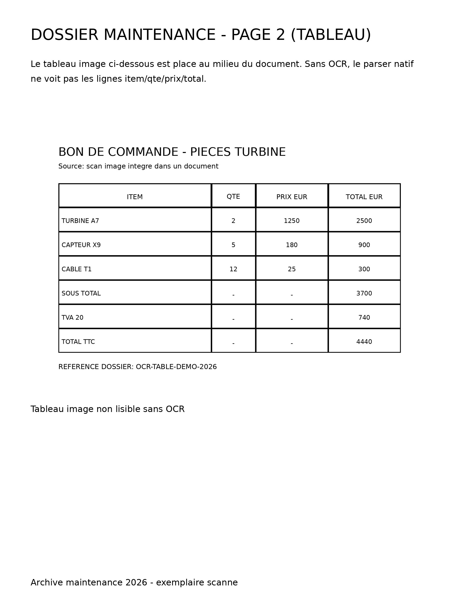
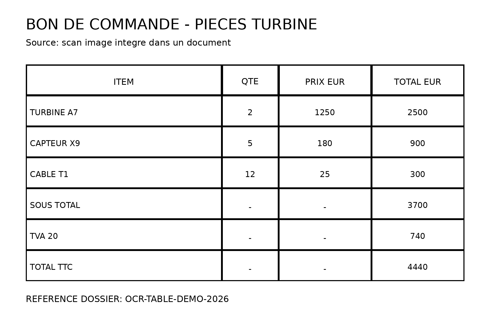

# OCR Real Table Examples Report

- Generated at: 2026-04-20 06:35:47 UTC
- Objective: provide concrete OCR proofs on table data hidden inside image content in PDF and DOCX.

## Example A - PDF with table image in the middle of the document

- Source file: assets/ocr_table_middle_pdf_demo.pdf
- Preview (page 2):



### OCR ON (expected production mode)

- parser_strategy: pdfplumber:pdf|table_text_excluded:1|libs:pdfplumber=0.11.5|ocr_pages:3|ocr_supplement_pages:3|ocr_trace:p1:rapidocr|lines:4|avg_conf:0.98,p2:rapidocr|lines:30|avg_conf:0.99,p3:rapidocr|lines:4|avg_conf:0.98
- parser_error: None
- ocr_attempted: True
- ocr_used: True
- ocr_pages: 3
- ocr_supplement_pages: 3
- text_length: 883

```text
DOSSIERMAINTENANCE-PAGE2(TABLEAU)
Le tableauimageci-dessous estplace au milieu du document.Sans OcR,le parser natif
ne voit pas les lignes item/qte/prix/total.
BONDECOMMANDE-PIECESTURBINE
Source:scanimageintegredansundocument
QTE
ITEM
PRIXEUR
TOTALEUR
TURBINEA7
1250
2500
006
5
CAPTEURX9
CABLE T1
12
740
TVA 20
TOTAL TTC
4440
REFERENCEDOSSIER:OCR-TABLE-DEMO-2026
```

### OCR OFF (control baseline)

- parser_strategy: pdfplumber:pdf|table_text_excluded:1|libs:pdfplumber=0.11.5
- parser_error: None
- ocr_attempted: False
- ocr_used: False
- text_length: 31

```text
## Page 1
## Page 2
## Page 3
```

## Example B - DOCX with embedded table image in the middle of content

- Source file: assets/ocr_table_middle_docx_demo.docx
- Embedded table image source:



### OCR ON (with embedded image OCR in DOCX parser)

- parser_strategy: python_docx:docx|libs:python-docx=1.1.2|docx_images:1|ocr_embedded_images:1/1|ocr_trace:img1:rapidocr|lines:25|avg_conf:0.97
- parser_error: None
- ocr_attempted: True
- ocr_used: True
- ocr_pages: 1
- ocr_supplement_pages: 1
- text_length: 681

```text
# Compte rendu maintenance turbines - Avril 2026
Ce document DOCX contient du texte natif, mais aussi un tableau scanne en image au milieu de la page.
Objectif parsing: recuperer les colonnes ITEM, QTE, PRIX EUR et TOTAL EUR meme quand elles sont presentes uniquement dans une image.
Tableau image integre:
Commentaire apres tableau: verification metier attendue sur TOTAL TTC = 4440 EUR.
## OCR embedded images
### Embedded image 1
BON DE COMMANDE - PIECES TURBINE
Source: scan image integre dans un document
QTE
1250
2500
TURBINEA7
2
180
900
CAPTEURX9
5
25
740
4440
TOTAL TTC
REFERENCEDOSSIER:OCR-TABLE-DEMO-2026
```

### OCR OFF (control baseline)

- parser_strategy: python_docx:docx|libs:python-docx=1.1.2
- parser_error: None
- ocr_attempted: False
- ocr_used: False
- text_length: 392

```text
# Compte rendu maintenance turbines - Avril 2026
Ce document DOCX contient du texte natif, mais aussi un tableau scanne en image au milieu de la page.
Objectif parsing: recuperer les colonnes ITEM, QTE, PRIX EUR et TOTAL EUR meme quand elles sont presentes uniquement dans une image.
Tableau image integre:
Commentaire apres tableau: verification metier attendue sur TOTAL TTC = 4440 EUR.
```

## Key takeaway

These examples show the practical gain of OCR on non-native table content:
- PDF case: table text inside scanned page images is recoverable only when OCR is enabled.
- DOCX case: embedded image tables are now captured via OCR and appended to parsed output.
